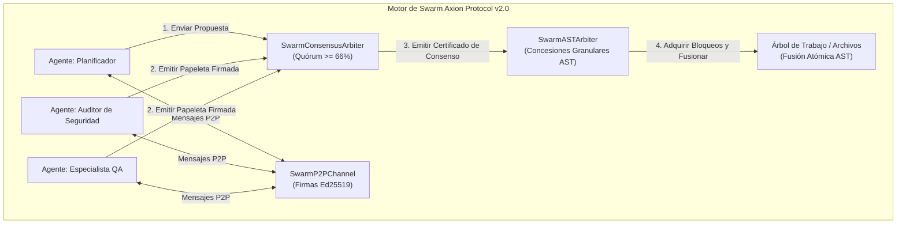

# Axion Protocol v2.0 — Especificación de Arquitectura Swarm

> **Coordinación Multi-Agente Determinista, Bloqueo AST Granular y Consenso por Quórum Bizantino.**

---

## 🏛️ Resumen Ejecutivo

Axion Protocol v2.0 introduce una capa de gobernanza multi-agente descentralizada y determinista diseñada para enjambres de desarrollo autónomo. Elimina los puntos únicos de fallo, el agotamiento de contexto y las colisiones de escritura concurrente mediante tres pilares soberanos:

1. **Bloqueo Granular de Símbolos AST (`SwarmASTArbiter`)**: Bloqueo a nivel sub-archivo que permite a múltiples agentes editar diferentes funciones del mismo archivo en paralelo.
2. **Bus de Mensajería P2P Autenticado con Ed25519 (`SwarmP2PChannel`)**: Buzones atómicos en disco con protección anti-replay mediante nonces criptográficos.
3. **Consenso por Quórum Bizantino BFT (`SwarmConsensusArbiter`)**: Votación por supermayoría ($\ge \frac{2}{3}$) con papeletas firmadas digitalmente antes de aplicar mutaciones.

---

## 🔒 Pilar 1: Árbitro AST Granular (`tools/swarm_ast_arbiter.js`)

El bloqueo tradicional de archivos enteros crea cuellos de botella cuando múltiples agentes colaboran. `SwarmASTArbiter` indexa el código a nivel de nodo AST:

- **Formato de Clave:** `<rutaRelativa>::<nombreDeSimbolo>` (ej. `src/auth.js::validateSession`).
- **Expiración de Concesiones:** Time-To-Live (TTL por defecto: 30,000 ms). Si un agente se congela, los bloqueos decaen automáticamente.
- **Fusión AST de 3 Vías:** Los parches no colisionantes se sintetizan en un único archivo canónico mediante ciclos atómicos de escritura temporal y renombramiento.

---

## 📡 Pilar 2: Bus P2P Criptográfico (`tools/swarm_p2p_channel.js`)

La comunicación entre sub-agentes se autentica mediante firmas digitales Ed25519 para prevenir inyecciones de prompt, suplantaciones y ataques de repetición:

- **Aislamiento de Buzones:** Almacenados en `.axion/swarm/mailboxes/<agentId>/inbox.jsonl`.
- **Anexo Atómico:** Cero dependencias de red; colas respaldadas puramente en disco local.

---

## ⚖️ Pilar 3: Consenso por Quórum Bizantino (`tools/swarm_consensus_arbiter.js`)

Antes de que cualquier mutación estructural toque el árbol de trabajo, el enjambre ejecuta una ronda de votación bizantina local:

$$\text{Ratio de Aprobación} = \frac{\sum \text{APPROVE}}{\sum \text{APPROVE} + \sum \text{REJECT}} \ge 0.66$$

1. **Propuesta:** El agente proponente emite un `ActionProposal` con la huella SHA-256 del diff AST.
2. **Recolección de Votos:** Los agentes especialistas analizan el diff según sus criterios de dominio y firman su papeleta con Ed25519.
3. **Certificado de Consenso:** Emite un certificado inmutable SHA-256 anexado a la cadena de atestación DSSE / in-toto.

---

## 🛡️ Regla de Cero Dependencias Externas

Todas las operaciones criptográficas, análisis léxico AST y gestión de buzones emplean exclusivamente la **Biblioteca Estándar de Node.js (`crypto`, `fs`, `path`)**.
