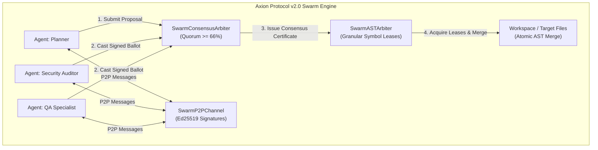

# Axion Protocol v2.0 — Swarm Architecture Specification

> **Deterministic Multi-Agent Coordination, Granular AST Locking, and Byzantine Quorum Consensus.**

---

## 🏛️ Abstract

Axion Protocol v2.0 introduces a decentralized, deterministic multi-agent governance layer designed for autonomous coding swarms. It eliminates single-agent failure modes, context exhaustion bottlenecks, and concurrent file-write collisions through three sovereign pillars:

1. **Granular AST Symbol Locking (`SwarmASTArbiter`)**: Sub-file locking allowing concurrent agents to edit distinct symbols in the same file simultaneously.
2. **Ed25519 P2P Authenticated Message Bus (`SwarmP2PChannel`)**: Nonce-protected, anti-replay messaging mailboxes on disk.
3. **Byzantine Fault Tolerant Quorum Consensus (`SwarmConsensusArbiter`)**: Supermajority ($\ge \frac{2}{3}$) cryptographic voting before applying mutations.



---

## 🔒 Pillar 1: Granular AST Symbol Arbiter (`tools/swarm_ast_arbiter.js`)

Traditional file locking creates synchronization bottlenecks when multiple agents collaborate. `SwarmASTArbiter` indexes code at the AST node level:

- **Key Format:** `<relativePath>::<symbolOrMethodName>` (e.g. `src/auth.js::validateSession`).
- **Lease Expiration:** Time-To-Live (TTL default: 30,000 ms). If an agent crashes, locks decay automatically.
- **3-Way AST Merge:** Non-colliding edits are synthesized into a canonical file using atomic write-temp-rename cycles.

---

## 📡 Pillar 2: Cryptographic P2P Message Bus (`tools/swarm_p2p_channel.js`)

Communication between subagents is authenticated using digital signatures to prevent prompt injections, spoofing, and replay attacks:

```json
{
  "body": {
    "version": "2.0.0",
    "senderId": "agent-planner",
    "recipientId": "agent-security",
    "topic": "AST_MUTATION_APPROVAL",
    "payload": { "file": "src/core.js", "symbol": "auth" },
    "timestamp": "2026-09-01T18:20:00.000Z",
    "nonce": "c4b9f31a29e8751d..."
  },
  "signature": "MEQCIG7...",
  "digest": "e3b0c442...",
  "algorithm": "Ed25519"
}
```

- **Mailbox Isolation:** Stored in `.axion/swarm/mailboxes/<agentId>/inbox.jsonl`.
- **Atomic Append:** Zero network dependencies; purely local disk-backed queues.

---

## ⚖️ Pillar 3: Byzantine Quorum Consensus (`tools/swarm_consensus_arbiter.js`)

Before any structural mutation touches the working tree, the swarm executes a local Byzantine voting round:

$$\text{Approval Ratio} = \frac{\sum \text{APPROVE}}{\sum \text{APPROVE} + \sum \text{REJECT}} \ge 0.66$$

1. **Proposal:** Proposer broadcasts an `ActionProposal` with SHA-256 AST diff digest.
2. **Ballot Collection:** Specialized agents evaluate the diff against their domain criteria (OWASP rules for Security, AAA patterns for QA) and sign their vote.
3. **Consensus Certificate:** Emits an immutable SHA-256 certificate attached to the in-toto DSSE attestation chain.

---

## 🛡️ Zero External Dependencies Rule

All cryptographic operations, AST token slicing, and mailbox queuing use exclusively the **Node.js Standard Library (`crypto`, `fs`, `path`)**.
